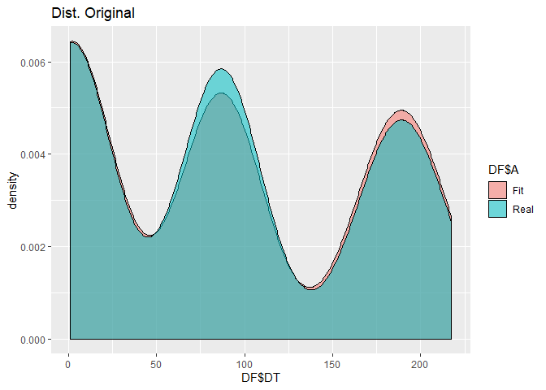

<!-- README.md is generated from README.Rmd. Please edit that file -->

# FitUltD

<!-- badges: start -->

<!-- badges: end -->

The goal of FitUltD is to fit data that can’t be fitted with ordinary
density functions

## Installation

You can install the released version of FitUltD from
[CRAN](https://CRAN.R-project.org) with:

``` r
install.packages("FitUltD")
```

## Example

This is a basic example which shows you how to solve a common problem:

``` r
library(FitUltD)
FIT1<-FDistUlt(c(rnorm(73,189,12),rweibull(82,401,87),rgamma(90,40,19)), plot=TRUE)
#> Error in computing default starting values.
#> Error in computing default starting values.
#> Error in computing default starting values.
#> Error in computing default starting values.
#> Error in computing default starting values.
#> Error in computing default starting values.
#> Error in computing default starting values.
#> Error in computing default starting values.
#> Error in computing default starting values.
#> Error in computing default starting values.
#> Error in computing default starting values.
#> Error in computing default starting values.
```

What is special about using `README.Rmd` instead of just `README.md`?
You can include R chunks like so:

``` r
FIT1[[3]]
#>               Distribucion Prop_dist    AD_p.v    KS_p.v Chs_p.v
#> AD4     lnorm(5.24, 0.077) 0.2979592 0.9675941 0.9298268       0
#> AD12   norm(86.871, 0.277) 0.3346939 0.6223739 0.7982842       0
#> AD2  gamma(48.145, 22.723) 0.3673469 0.9556936 0.9826995       0
```

You’ll still need to render `README.Rmd` regularly, to keep `README.md`
up-to-date.

You can also embed plots, for example:



In that case, don’t forget to commit and push the resulting figure
files, so they display on GitHub\!
